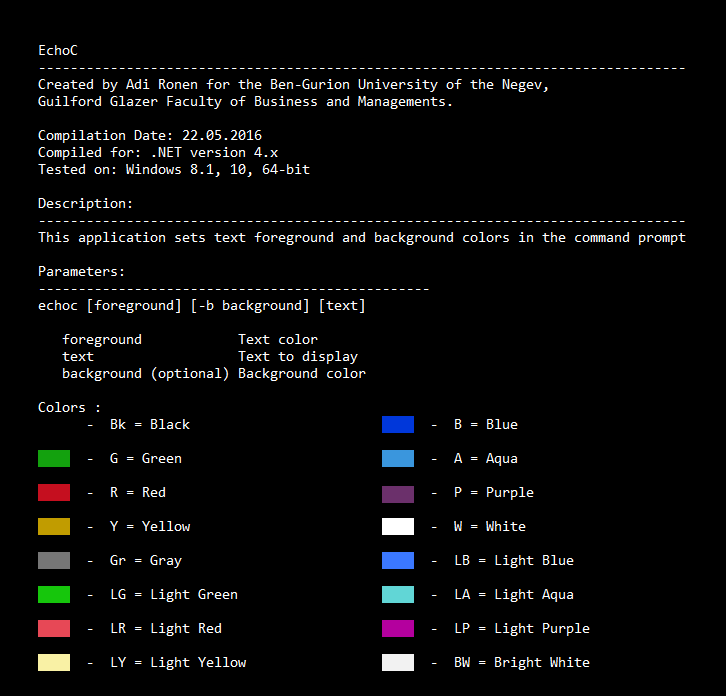

# echoc
This application sets text foreground and background colors in the command prompt

<h3>How to use: </h3>

1. place EchoC.exe file under "C:\Windows" folder

2. open command prompt and write 'echoc'

